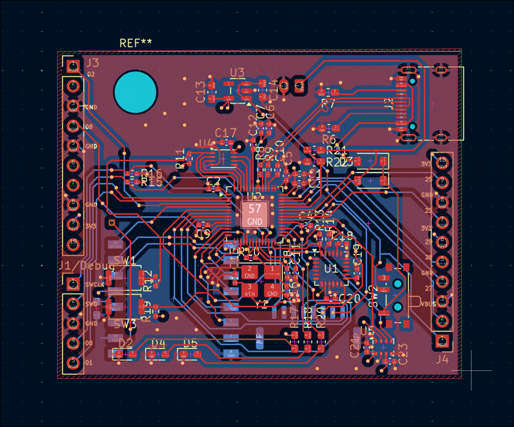
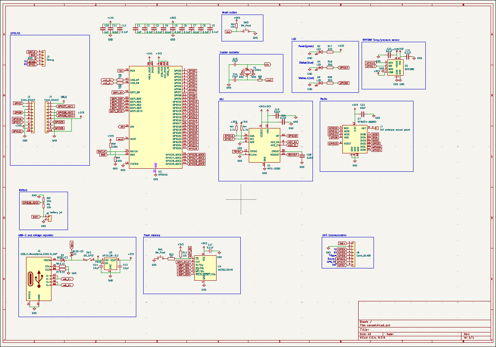
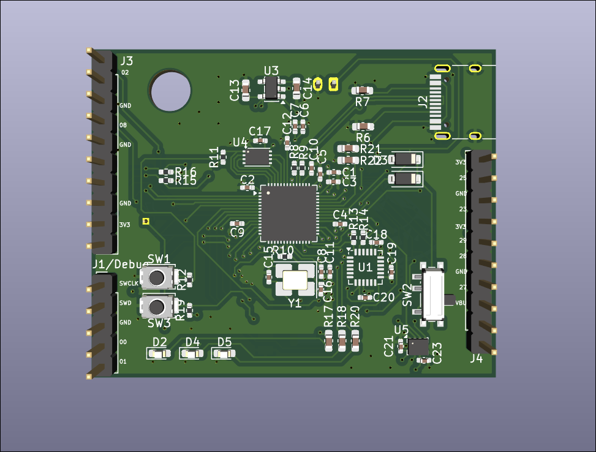

# Glidesat
Custom devboard with additional components for ESA cansat competition. 

This PCB is for ESA cansat competition and I made it because I thought premade devboards like rp pico is too big and limiting for my team's goal. So I made this devboard to save as much space as possible and to connect to CM4 module for image processing. 

It is most complex PCB project so it was quite difficult to work on it, but with some help from background knowledge from previous projects, i think it went smoothly :)

Here are screenshots of PCB Design

## PCB Design

## Schematic

## 3D View

---

## BOM

| Component                      |   Quantity |  Price    | Net price   | Source                                                                                    |       |    |
|:-------------------------------|-----------:|:----------|:------------|:------------------------------------------------------------------------------------------|:----------------|:-------------|
| Capacitor 1uF                  |        100 | € 0.0015           | € 0.15             | https://www.lcsc.com/product-detail/C14445.html                                           |              |           |
| Capacitor 0.1uF                |        100 | € 0.0011           | € 0.11             | https://www.lcsc.com/product-detail/C1525.html                                            |              |           |
| Capacitor 10uF                 |         50 | € 0.0051           | € 0.26             | https://www.lcsc.com/product-detail/C19702.html                                           |              |           |
| Capacitor 33pF                 |        100 | € 0.0030           | € 0.30             | https://www.lcsc.com/product-detail/C70465.html                                           |              |           |
| Capacitor 2.2nF                |        100 | € 0.0033           | € 0.33             | https://www.lcsc.com/product-detail/C84703.html                                           |              |           |
| B130-E3                        |         10 | € 0.0435           | € 0.44             | https://www.lcsc.com/product-detail/C129191.html                                          |              |           |
| LED(RED)                       |        100 | € 0.0048           | € 0.48             | https://www.lcsc.com/product-detail/C19171390.html                                        |              |           |
| LED(GREEN)                     |        100 | € 0.0047           | € 0.47             | https://www.lcsc.com/product-detail/C19273151.html                                        |              |           |
| LED(BLUE)                      |        100 | € 0.0036           | € 0.36             | https://www.lcsc.com/product-detail/C19171394.html                                        |              |           |
| USB_C_Receptacle_USB2.0_14P    |          5 | € 0.1533           | € 0.77             | https://www.lcsc.com/product-detail/C165948.html                                          |              |           |
| Header pins                    |         10 | € 0.0150           | € 0.15             | https://www.lcsc.com/product-detail/C42431810.html                                        |              |           |
| BM08B-GHS-TBT(LF)(SN)          |          5 | € 0.3074           | € 1.54             | https://www.lcsc.com/product-detail/C133062.html                                          |              |           |
| Resistor 5.1k 0603             |        100 | € 0.0008           | € 0.08             | https://www.lcsc.com/product-detail/C2907044.html                                         |              |           |
| Resistor 27k 0402              |        100 | € 0.0006           | € 0.06             | https://www.lcsc.com/product-detail/C138017.html                                          |              |           |
| Resistor 1k 0402               |        100 | € 0.0006           | € 0.06             | https://www.lcsc.com/product-detail/C106235.html                                          |              |           |
| Resistor 10k 0402              |        100 | € 0.0006           | € 0.06             | https://www.lcsc.com/product-detail/C60490.html                                           |              |           |
| Resistor 2.7k 0402             |        100 | € 0.0007           | € 0.07             | https://www.lcsc.com/product-detail/C138017.html                                          |              |           |
| Resistor 100k 0402             |        100 | € 0.0006           | € 0.06             | https://www.lcsc.com/product-detail/C60491.html                                           |              |           |
| Resistor 330 0603              |        100 | € 0.0010           | € 0.10             | https://www.lcsc.com/product-detail/C23138.html                                           |              |           |
| Resistor 220 0603              |        100 | € 0.0010           | € 0.10             | https://www.lcsc.com/product-detail/C22962.html                                           |              |           |
| Resistor 10k 0603              |        100 | € 0.0010           | € 0.10             | https://www.lcsc.com/product-detail/C98220.html                                           |              |           |
| Resistor 22k 0603              |        100 | € 0.0011           | € 0.11             | https://www.lcsc.com/product-detail/C114065.html                                          |              |           |
| SW_Push(XUNPU TS-1088-AR02016) |         10 | € 0.0369           | € 0.37             | https://www.lcsc.com/product-detail/C720477.html                                          |              |           |
| SW_SPST(C&K PCM12SMTR)         |          3 | € 1.0445           | € 3.13             | https://www.lcsc.com/product-detail/C221841.html                                          |              |           |
| MPU-6050                       |          3 | € 5.9586           | € 17.88             | https://www.lcsc.com/product-detail/C24112.html                                           |              |           |
| RP2040                         |          3 | € 0.8250           | € 2.48             | https://www.lcsc.com/product-detail/C2040.html                                            |              |           |
| AP2112K-3.3                    |          5 | € 0.0803           | € 0.40             | https://www.lcsc.com/product-detail/C23380830.html                                        |              |           |
| W25Q128JVSIQ                   |          3 | € 1.4281           | € 4.28             | https://www.lcsc.com/product-detail/C97521.html                                           |              |           |
| BMP280                         |          2 | € 5.2477           | € 10.50             | https://www.lcsc.com/product-detail/C83291.html                                           |              |           |
| RFM95W-868S2                   |          1 | € 9.5500           | € 9.55             | https://www.tme.eu/sk/en/details/rfm95cw-868s2/rf-modules/hope-microelectronics/?brutto=1 |              |           |
| X322512MSB4SI                  |         10 | € 0.0592           | € 0.59             | https://www.lcsc.com/product-detail/C9002.html                                            |              |           |
|                             |         |        |          |                                                                                        |              |           |
| Shipping LCSC                  |         |        | € 8.49             |                                                                                        |              |           |
| Discount                       |         |        | € 6.00             |                                                                                        | Component total | € 64.47              |
| Shipping from time.eu          |         |        | € 6.64             |                                                                                        |              |           |
|                             |         |        |          |                                                                                        |              |           |
| PCB                            |         |        | € 9.70             | JLCPCB                                                                                    |              |           |
| Shipping(GSDL)                 |         |        | € 7.18             |                                                                                        |              |           |
| Tax                            |         |        | € 2.58             |                                                                                        | PCB Total       | € 19.46              |
|                             |         |        |          |                                                                                        |              |           |
|                             |         |        |          |                                                                                        |              |           |
| TOTAL                          |         |        | € 83.93EUR (about $98.82)             |                                                                                        |              |           |